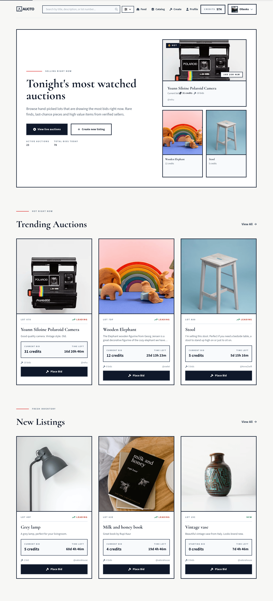
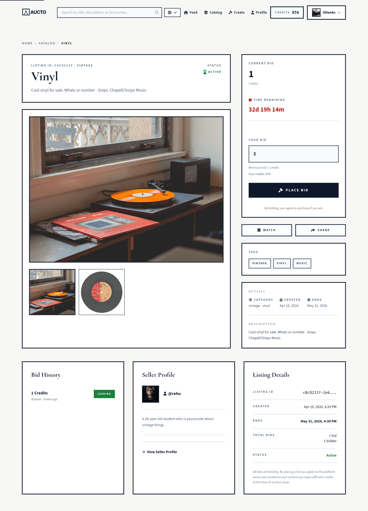
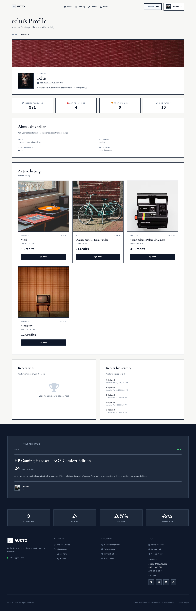

# Aucto

   

A minimal, brutalist online auction platform. Browse live lots, place bids, list items, manage your collection — built around the idea that the products themselves should drive the visual hierarchy, with the interface staying out of the way.

**Live**: [auctohouse.netlify.app](https://auctohouse.netlify.app/) · **Stack**: vanilla TypeScript + Tailwind v3 + Vite (multi-page app) → Netlify



---

## Why I built this

I wanted a project where design served function rather than decoration. Auction items have strong visual identity on their own, the temptation is to wrap them in chrome, but in practice that just dilutes them. Aucto leans into the content: bento-style grids, a neutral palette, 3px borders, Cormorant headings against Source Sans 3 body, and zero radii except on a single Toast component. The result is a tool-like, mechanical interface that supports browsing without competing with the lots.

The other goal was to ship a real-world front-end without leaning on a framework. No React, no router, no SPA. Each HTML file is its own Vite entry, each page module owns its own DOM mounting, and navigation is just real navigation. It's a constraint that forces you to think hard about what state actually needs to persist and what abstractions actually carry their weight.

## Engineering decisions

**Multi-page app, no router.** Eight HTML files, eight Vite entries declared in `vite.config.ts`. Page modules in `src/pages/<Name>.ts` orchestrate their page, importing `renderHeader` / `renderFooter` from shared components. Auction listings are content, not application state — there's nothing here that wouldn't be served better by a fresh page load.

**Single API client, centralised auth.** Every network call goes through `apiClient<T>` in `src/api/config.ts`. It injects the API key and bearer token from localStorage, parses JSON, throws a typed `ApiErrorClass` on non-2xx responses, and handles 401 in one place — clearing auth, showing a toast, and redirecting to login with the original URL preserved. Domain modules (`auth.ts`, `bids.ts`, `listings.ts`, `profile.ts`) are thin wrappers over `api.get/post/put/delete`. Pages never call `fetch` directly.

**Storage as the auth contract.** `src/utils/storage.ts` owns every localStorage key the app uses (`token`, `tokenTimestamp`, `user`, `watchedListings`). Pages and components access auth state and the watchlist exclusively through its exported helpers. Token expiry is checked client-side at 7 days; the server's actual lifetime is independent and a real 401 still wins.

**Componentisation drove the refactor.** Filter logic originally lived in three places — the navbar, the sticky filter bar, and the catalog page script. Cross-component drift was inevitable. Extracting `CategoryFilters`, `SortDropdown`, `ActiveOnlyCheckbox`, and `SearchField` into self-contained components that dispatch CustomEvents (`categoryFilterChange`, `sortChange`, etc.) collapsed three implementations into one and made the catalog state synchronisation trivial. The auth-page product showcases (`ProductShowcase`) and the listing-form preview widgets (`ListingFormPreview`) followed the same pattern.

**Escaping is a rule, not a habit.** Any Noroff student can create a listing, and a `"` in a listing title used to close the `alt="` attribute it was interpolated into and turn everything after it into new attributes — `onerror` included. That was reproduced, not theorised. `src/utils/escapeHtml.ts` now covers all 91 interpolations of user data across 11 files, and `src/components/renderEscaping.test.ts` renders every card component with a hostile listing and fails if anything gets injected. Attribute context is the dangerous one: `src=` is exactly as exposed as `alt=`, because `imgAttrs.src` is `media[0].url` verbatim.

**Named queries, not hand-built parameters.** No page calls `getListings` directly. They call `src/api/listingQueries.ts`, which names the intent — `activePool`, `endingSoon`, `trending`, `catalogPage`. Every surface used to fetch the newest 50 listings and filter them in the browser, and only about 2% of the pool is active, so each one was wrong in its own way: Trending rendered 2 cards, and the hero told visitors the platform had 3 live auctions. The layer exists to encode four API behaviours that are measured rather than assumed — `_active=false` is silently ignored, an unknown `sort` field is a 500, the search endpoint ignores `_active` and `_tag`, and the whole active pool fits in one request.

**A test suite shaped like the risks.** 273 unit tests over `utils/` and `api/`, plus a 66-test Playwright suite that serves every request from recorded fixtures with the page clock frozen, so a red run always means this code changed and never that a shared third-party API was slow. It asserts zero axe violations on 8 pages in both auth states, that no page scrolls sideways when every user-controlled field holds a 108-character word, and exact card counts — each carrying a comment recording what the number was when the surface was broken.

**Iterative, not waterfall.** I built a high-fidelity Figma prototype but treated it as a starting point. Reproducing layouts in code against real API data exposed limitations the static mockups couldn't predict — descriptions were often shorter than expected, leaving awkward space; the bento layout on the listing-detail page was a direct response. The brand identity, including the logo, evolved alongside the implementation rather than being locked first.

## Features

- **Browse without an account.** Listings, search, filters, listing detail, bid history.
- **Restricted registration** to `@stud.noroff.no` emails (the platform is built against the Noroff student API). New users get 1000 starter credits.
- **Live bidding** with client-side validation (must exceed current highest bid).
- **Listing management.** Create, edit, delete your own auctions. Live preview while you type.
- **Persistent watchlist** stored in localStorage, surfaced both on the listing-detail page and via the heart icon on each catalog card.
- **Profile management.** Avatar, banner, bio.
- **Accessibility, verified rather than claimed.** Zero axe violations across 8 pages in both auth states, asserted in CI. Landmarks and heading order on every page, skip links that move focus rather than only scrolling, a real focus trap on the delete dialog and the mobile drawer, `Escape` closing every overlay and returning focus to its trigger, live regions mounted before anything needs announcing, and `prefers-reduced-motion` honoured app-wide.
- **SEO.** Per-page title/description/canonical, Open Graph + Twitter cards, JSON-LD structured data for listings (Product schema), homepage (WebSite + Organization), sitemap, robots.

### Listing Detail Page



### Profile Page



---

## Stack

| Layer    | Choice                                           | Why                                                                                            |
| -------- | ------------------------------------------------ | ---------------------------------------------------------------------------------------------- |
| Language | TypeScript (strict)                              | `noUnusedLocals`, `noUnusedParameters`, `verbatimModuleSyntax`. Build runs `tsc` before Vite.  |
| Bundler  | Vite v7                                          | Multi-page entries via `rollupOptions.input`; ES2020 target, no legacy polyfills.              |
| Styling  | Tailwind v3                                      | Custom palette (`aucto.*`, `warm-white`), 3px border utility, Cormorant + Source Sans 3 fonts. |
| API      | [Noroff API v2](https://docs.noroff.dev/docs/v2) | JWT auth + API-key authorisation.                                                              |
| Testing  | Vitest + jsdom                                   | 273 unit tests across `utils/` and `api/`.                                                     |
| E2E      | Playwright                                       | 66 fully mocked smoke tests + 14 screenshot baselines. No network, frozen clock.               |
| Linting  | ESLint v9 (flat config) + Prettier               | `npm run lint` enforced in CI.                                                                 |
| CI       | GitHub Actions                                   | Type-check + lint + test + build on every PR and push to `main`.                               |
| Hosting  | Netlify                                          | Catch-all 404 redirect, security headers, asset caching.                                       |

---

## Getting started

```bash
git clone https://github.com/sergiu-sa/auction_house_sp2.git
cd auction_house_sp2
npm install
cp .env.example .env   # then fill in VITE_API_KEY (see .env.example)
npm run dev            # http://localhost:5173
```

### Scripts

| Command                                    | What it does                                                 |
| ------------------------------------------ | ------------------------------------------------------------ |
| `npm run dev`                              | Vite dev server with HMR.                                    |
| `npm run build`                            | `tsc` (typecheck) + `vite build` → `dist/`.                  |
| `npm run preview`                          | Serve the production build locally.                          |
| `npm run type-check`                       | TypeScript only, no emit.                                    |
| `npm run lint` / `npm run lint:fix`        | ESLint v9 flat config across `src/`.                         |
| `npm run format` / `npm run format:check`  | Prettier write / dry-run.                                    |
| `npm test`                                 | One-shot Vitest run.                                         |
| `npm run test:watch` / `:ui` / `:coverage` | Watch mode / UI / coverage report.                           |
| `npm run test:e2e`                         | Playwright smoke suite — fully mocked, no network needed.    |
| `npm run test:e2e:visual`                  | Screenshot baselines. macOS-keyed, so local only.            |
| `npm run test:e2e:visual:update`           | Regenerate those baselines — do this deliberately.           |
| `npm run fixtures:check`                   | Has the live API's shape drifted from the recorded fixtures? |
| `npm run fixtures:record`                  | Re-record the listings fixtures.                             |

`.env` (gitignored) needs `VITE_API_BASE_URL` and `VITE_API_KEY`. See `.env.example`.

---

## Project structure

```bash
src/
├── api/                # Single typed fetch wrapper + domain modules
│   ├── auth.ts         # /auth endpoints (register, login, create-api-key)
│   ├── bids.ts         # /auction/listings/:id/bids
│   ├── config.ts       # apiClient<T>, ApiErrorClass, handleUnauthorized
│   ├── listings.ts     # /auction/listings CRUD — the transport
│   ├── listingQueries.ts  # named queries; nothing else calls getListings
│   └── profile.ts      # /auction/profiles
│
├── components/         # renderX / initX functions returning HTML strings
│   ├── Breadcrumb.ts
│   ├── CollectionCard.ts ProductCard.ts QuickCard.ts
│   ├── Navbar.ts Footer.ts
│   ├── Newsletter.ts StatsBar.ts FeaturedWin.ts
│   ├── ProductShowcase.ts        # auth-page tile polling
│   ├── ListingFormPreview.ts     # live preview for create/edit
│   ├── PaginationComponent.ts Toast.ts GuestBanner.ts
│   └── filters/                  # SearchField, CategoryFilters, SortDropdown, …
│
├── pages/              # One module per HTML entry
│   ├── Home.ts Collection.ts ListingDetail.ts
│   ├── ListingCreate.ts ListingEdit.ts
│   ├── Login.ts Register.ts ProfilePage.ts
│
├── styles/main.css     # Tailwind imports, design tokens, header height reservation
├── types/api.ts        # Noroff response types
└── utils/              # Pure helpers, all tested next to their source
    ├── escapeHtml.ts   # every user-data interpolation goes through this
    ├── catalogState.ts # the filter state Home and Collection share
    ├── biddingStats.ts # highestBid, isStillRunning, win-rate arithmetic
    ├── profileCache.ts # 30s cache behind the navbar's credit display
    ├── announce.ts focusTrap.ts motion.ts   # accessibility primitives
    └── storage.ts auth.ts validation.ts formatDate.ts imageOptimization.ts seo.ts …

tests/e2e/              # Playwright. Every request served from fixtures/
├── pages.spec.ts       # all 8 pages load with zero console errors
├── a11y.spec.ts        # zero axe violations, plus focus and live regions
├── layout.spec.ts      # no page scrolls sideways on hostile content
├── home|collection|listing|auth.spec.ts     # exact counts, not "non-zero"
└── visual.spec.ts      # 14 screenshot baselines
```

---

## Testing

Two suites with different jobs. The unit suite asserts logic; the Playwright suite answers
"did we break the app?".

**273 unit tests across 19 files** (Vitest + jsdom), concentrated where a silent bug would be
worst:

| Area                                    | Tests | What it pins                                                                         |
| --------------------------------------- | ----- | ------------------------------------------------------------------------------------ |
| `src/utils/validation.test.ts`          | 47    | Noroff-domain email, password strength, URLs, bid amounts, JWT shape, username rules |
| `src/utils/formatDate.test.ts`          | 35    | time-remaining strings, the "Ended" boundary, relative timestamps                    |
| `src/api/listingQueries.test.ts`        | 28    | the real outgoing URL of every named query                                           |
| `src/utils/escapeHtml.test.ts`          | 21    | attribute break-out in both quote styles, `</textarea>`, double-escaping             |
| `src/utils/listingForm.test.ts`         | 20    | the listing form's media/tag round trip and local-time date formatting               |
| `src/utils/biddingStats.test.ts`        | 15    | highest bid by max rather than by last, and at 200k bids                             |
| `src/components/Navbar.test.ts`         | 12    | the drawer, the bind-once document listeners, the non-blocking credit refresh        |
| `src/utils/catalogState.test.ts`        | 11    | the filter state Home and Collection share                                           |
| `src/components/renderEscaping.test.ts` | 11    | every card component rendered with a hostile listing                                 |
| `src/utils/imageOptimization.test.ts`   | 9     | srcset construction and the `sizes` override                                         |
| the rest                                | 64    | icons and CSP, profile path encoding, login, currency, the card/skeleton parity      |

**66 Playwright smoke tests + 14 screenshot baselines.** Every request is served from
`tests/e2e/fixtures/` and the page clock is frozen at the instant they were recorded, so
countdowns render constant text and a red run always means this code changed. Prove the
mocking is still complete with `E2E_OFFLINE=1 npm run test:e2e`, which makes every host but
localhost unresolvable inside the browser.

The suite asserts zero axe violations on 8 pages in both auth states, that focus enters and is
trapped by the delete dialog, that no page gains horizontal scroll when every user-controlled
field holds a 108-character word, and **exact** card counts and result totals — each with a
comment recording what the number was when that surface was broken. None of them is loosened
to "non-zero", because that passes either way.

**Pages are intentionally untested** and excluded from coverage along with `src/types/**`;
logic worth testing belongs in `src/utils/` or `src/api/` and is tested next to its source. Coverage over the remainder is **41.5% of statements**, up from 17.7%.

```bash
npm test                 # one-shot run
npm run test:coverage    # v8 coverage -> coverage/index.html
npm run test:e2e         # the mocked smoke suite
E2E_OFFLINE=1 npm run test:e2e   # prove nothing reaches the network
```

---

## Deployment

Netlify, configured in `netlify.toml`:

- Build command `npm run build`, publish `dist/`.
- Catch-all `[[redirects]]` rule serves the branded `/404.html` on unknown URLs.
- **A Content-Security-Policy**, enforcing, plus a stricter report-only twin. The enforced
  policy keeps `'unsafe-inline'` in `script-src` because every page loads its stylesheets with
  `media="print" onload="this.media='all'"`, and CSP cannot allow an inline event handler by
  hash or by nonce. So it is _not_ an XSS backstop — escaping is. What it does buy is
  `object-src 'none'`, `base-uri`, `form-action`, `frame-ancestors 'none'` and a `connect-src`
  pinned to the Noroff API. The report-only twin carries the `script-src 'self'` we want and
  logs exactly the handlers that stand in the way.
- `X-Frame-Options: DENY`, `X-Content-Type-Options: nosniff`, `Referrer-Policy: no-referrer`.
- Immutable year-long caching on `/*.js`, `/*.css`, `/images/*` and `/*.svg` — verified against
  the hashed asset names in production, not just assumed from the glob. HTML is
  `must-revalidate`, so a deploy lands immediately.

CI (`.github/workflows/ci.yml`) runs type-check, lint, unit tests, build, and then installs
Chromium and runs the Playwright smoke suite, on every PR and push to `main`. The `visual`
project is deliberately excluded — Playwright keys screenshots by platform, so macOS baselines
would never match an Ubuntu runner. Production deploys are triggered by Netlify on merges to
`main`.

---

## The audit

Aucto shipped, scored an A, and then kept producing the same bug on a different screen. The
clearest case: `endsAt` filtering was fixed on the Collection page and on the home page's
"Ending Soon" section, and Trending and New Listings went on rendering two cards each — because
every surface built its own listings query and filtered the result in the browser. That is not a
bug list. It is a missing abstraction.

So I ran a seven-phase audit over the repo: measure everything first, fix causes rather than
symptoms, and prove each phase with numbers. One phase, one branch, one PR, so anything that
turned out wrong could be reverted on its own. Every phase started by re-reading its own plan
against the code as it actually was and writing down what had gone stale.

### What the numbers did

|                                            | Before (2026-08-22)           | After (2026-09-02)                   |
| ------------------------------------------ | ----------------------------- | ------------------------------------ |
| Unit tests                                 | 75                            | **204**                              |
| End-to-end tests                           | none                          | **64**, plus 14 screenshot baselines |
| Statement coverage                         | 17.7%                         | **38.2%**                            |
| axe violations, 8 pages × 2 auth states    | 50 logged out, 59 logged in   | **0**, asserted in CI                |
| Lighthouse accessibility                   | 90 / 95 / 96 / 96 / 96        | **100 on every page**                |
| Escaping at user-data sinks                | **none existed**              | **91**                               |
| Surfaces building their own listings query | 7                             | **0**                                |
| Content-Security-Policy                    | none                          | enforcing + report-only              |
| Home page weight, mobile                   | 779 kB                        | **577 kB**                           |
| Home Lighthouse performance, mobile        | 89                            | **100**                              |
| Cumulative layout shift, mobile            | 0.213 home · 1.365 collection | **0.013** · **0.308**                |

Lighthouse figures are the median of three runs on the same production build; the same sweep run
twice against unchanged production returned identical numbers, so these are not noise.

### What was actually wrong

**Stored XSS, reproduced rather than theorised.** A `"` in a listing title closed the `alt="`
attribute it was interpolated into; everything after it parsed as new attributes, `onerror`
included, and the payload executed. Any Noroff student can create a listing. The fix was an
escaper applied at all 91 interpolations across 11 files, plus a test that renders every card
component with a hostile listing and fails if anything gets through. Attribute context is the
sharp end — the original inventory recorded the `alt=` on each card image and missed the `src=`
one line above it, even though that value is the listing's media URL verbatim.

**The catalog was a 50-item window.** Measured against the live API: 3,199 listings, 53 active.
Every "active" surface fetched the newest 50 and filtered them, so the hero told visitors the
platform had 3 live auctions when it had 53, and the results counter printed the fetch limit.
Search was worse — `q=` is silently ignored by `/auction/listings`, so the parameter looked
functional and returned the entire pool as if everything matched. All of it now goes through
named queries that encode what the API actually honours.

**Four accessibility failures that only a signed-in scan could see**, because three pages are
auth-gated: the listing-edit form had no programmatic labels at all, and the delete-confirmation
dialog — guarding an irreversible action — was not a dialog. No role, no accessible name, focus
never entered it, Tab walked into the footer behind the scrim, and Escape did nothing.

**A 108-character word in a listing title scrolled whole pages sideways.** A flex item's
`min-width` defaults to `auto`, so its floor is the min-content width of its text, and
`break-words` does not lower that. `min-w-0` appeared zero times in the codebase.

**The navbar is rendered by JavaScript into an empty `<header>`**, so every page dropped its main
content by the navbar's height at first paint. That one event was 97% of the home page's layout
shift and 73% of the catalog's. It is now reserved in CSS from measured heights.

**Font Awesome was 295 kB per page for 71 icons** — nine times the weight of everything this
codebase compiles to — including 118 kB of brand webfont for four footer icons, which are now
inline SVG. Subsetting the remaining face is the biggest win left on the table, and it needs a
build step plus a rule nobody can forget, so it is filed rather than rushed.

### What I got wrong along the way

Worth more than the fixes, and the reason the phases were structured to catch it.

- **"Accessibility is essentially absent."** A grep of the eight HTML files found 5 `aria-*`
  attributes and produced a confident, wrong conclusion. Most markup here is generated in
  TypeScript; re-grepping found 105, plus skip links on every page. The phase became
  verify-and-close instead of rebuild.
- **"Contrast implicates the palette."** It made a mechanical fix look like a design negotiation
  for over a week. Measured: zero violations involved a brand colour. All 91 were two greys.
- **I built the header fix, measured it, and deleted it.** The plan called for an inline script
  reading `localStorage` before paint. It worked. It also cost 450 ms of first paint and two
  Lighthouse points — and a no-op script in the same position cost the same, so it was the
  parser block, not the storage read. The shipped version sets the same attribute one frame
  later from code that already runs.
- **A green test suite proved less than it looked.** An overflow test that mutated the title and
  the username passed while four pages still scrolled sideways, because every other
  user-controlled field was still benign. A zero-axe-violation assertion passed over a real
  contrast failure for weeks, because the badge that fails renders only for an active lot with
  at least one bid and more than six hours left, and no recorded fixture produces that
  combination. A second instrument found it in one run.

---

## Browser support

ES2020 target. Tested on Chrome 90+, Firefox 88+, Safari 14+, Edge 90+. iOS Safari 14+, Chrome Mobile 90+, Samsung Internet 15+. No IE.

---

## Author

**Sergiu Sarbu** · [GitHub](https://github.com/sergiu-sa)

## License

MIT © 2026 Sergiu Sarbu. See [LICENSE](LICENSE).
